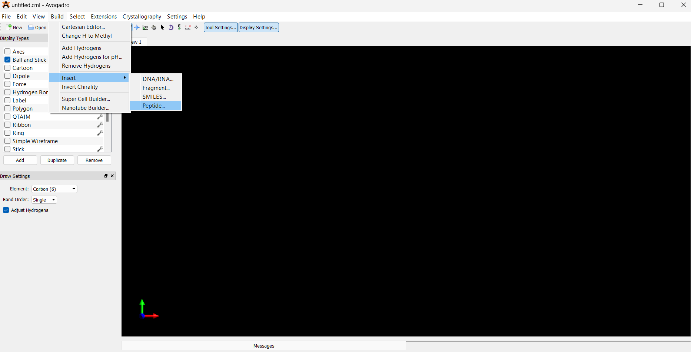
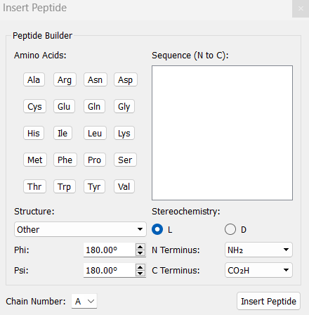
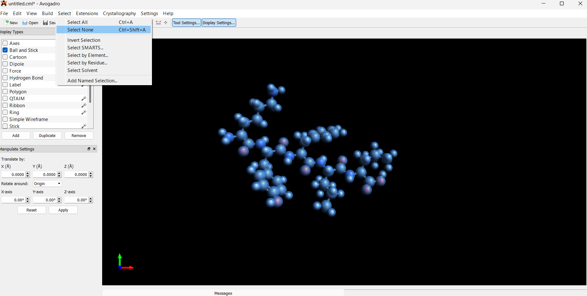
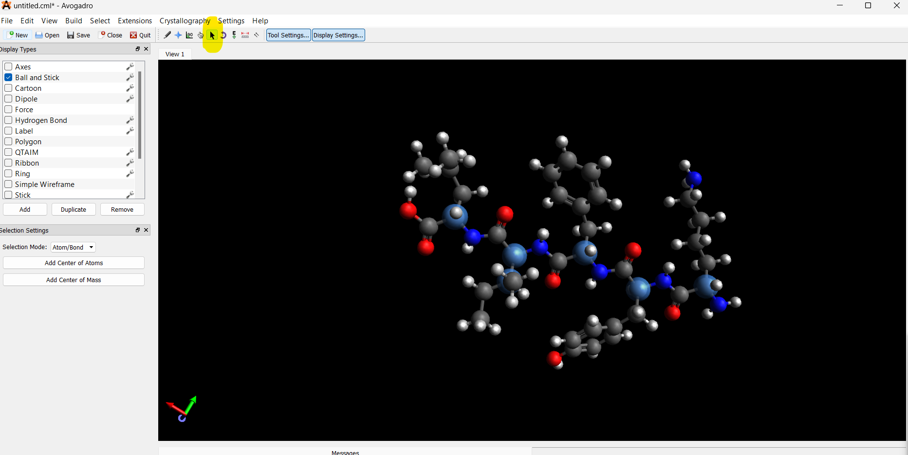
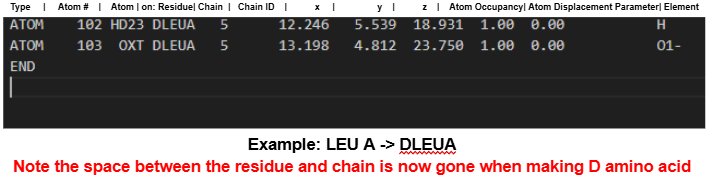
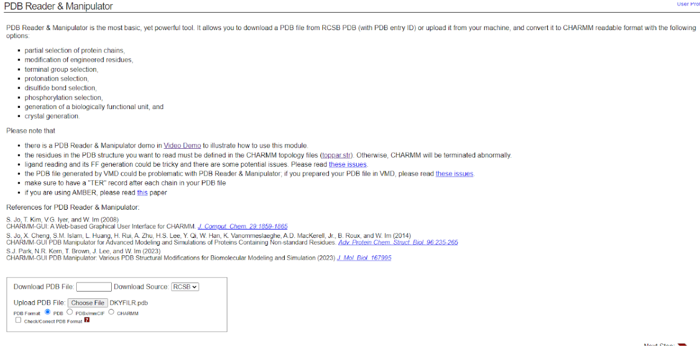
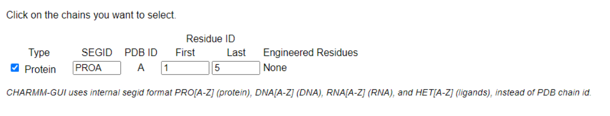
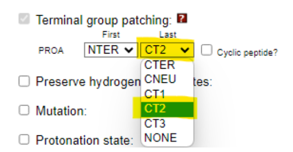
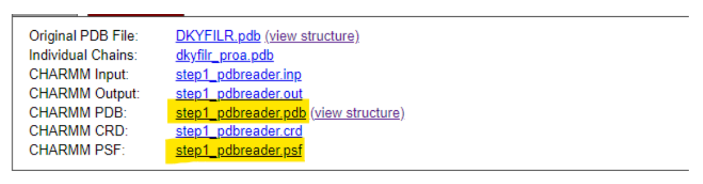
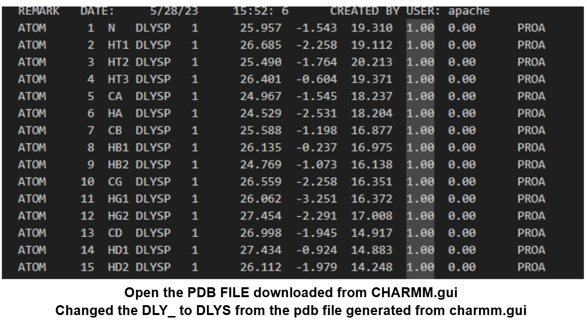

# Avogadro Tutorial

This tutorial will guide you through building a peptide in Avogadro and preparing it for use in simulations, with attention to **chirality editing** for D-amino acids.

---

### Step 1: Open Avogadro and Build Peptide

1. Launch Avogadro.

2. Navigate to the top menu:
   **Build → Insert → Peptides**

   

3. In the **Insert Peptides** window, click to add the desired amino acids to construct your peptide.
   Example: `KYFIL` → Lys-Tyr-Phe-Ile-Leu

   

---

### Step 2: Modify to D-Stereochemistry (if needed)

For **D-amino acids**, you must manually invert chirality:

1. **Deselect the entire structure**:
   **Select → Select None**

   

2. **Manually select the α-carbon** on the amino acid residue (and β-carbon for Ile):

   * Only select the **α-carbon** and adjacent **β-carbon** for each D-amino acid.

   

3. **Invert chirality**:
   **Build → Invert Chirality** (or right-click if using tools)

Repeat for each D-residue. Avogadro does not automatically label chirality, so this step is crucial for accuracy.

---

### Step 3: Save and Modify PDB File

After saving your `.pdb` file:

* **For D-residues**, manually update the residue names in a text editor:

  * Change 3-letter amino acid codes to include a **D** prefix (e.g., `TYR` → `DTYR`).
  * Ensure there are **no spaces** in the updated codes.

  

---

### Step 4: Use CHARMM-GUI for Further Processing

1. Go to [CHARMM-GUI PDB Reader](https://charmm-gui.org/?doc=input/pdbreader).

2. Upload your edited PDB file under **PDB Reader & Manipulator**.

   

3. Leave the default settings unchanged.

   

4. **Amidate the C-terminus** by checking the appropriate box.

   

5. Download the processed files (e.g., PSF and PDB).

   

6. Open the downloaded `.pdb` file and reapply the D-prefix to any D-residues if CHARMM-GUI reverted them.

   

---

### Notes

* **For L-amino acids**, you do **not** need to invert chirality or change residue codes.
* After generating your final structure, proceed to the appropriate tutorial:

  * For **atomistic simulations**, use the [NAMD](https://www.ks.uiuc.edu/Research/namd/) or [GROMACS](http://www.gromacs.org/) workflow.
  * For **coarse-grained simulations**, continue to the [Coarse Grain with GROMACS Tutorial](#).

---
