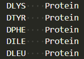

# Gromacs Tutorial

The necessary files will be downloadable [here](https://drive.google.com/drive/folders/1jqYImmEjs-hWhx8nukfLdDuEJOevQhQ5?usp=sharing).

For a quick tutorial on Gromacs in general, please do [this](http://www.mdtutorials.com/gmx/lysozyme/01_pdb2gmx.html).

For D amino acids, include a residuetype.dat file to introduce a new residue into an existing force field. You will need to have this folder in the same file where you make your system.

It should be the 3 or 4 letter amino acid code that was build during the avogadro step. It should look something like this. You will need to have this folder in the same file where you make your system.



First, open Avogadro and create your amino acid using this [tutorial](tutorial_avogadro.md).

Next open up the shell terminal in Rivanna. Type the command to be able to use Gromacs Commands.

```gromacs
module load gcc/11.4.0 openmpi/4.1.4 gromacs/2023.2
```
This command switches the pdb format to a gromacs format.

```gromacs
gmx_mpi pdb2gmx -f dkyfilinvert.pdb -o dkyfil.gro
```

Options will show up:
1. Press 1 for charm force field from my own ff
2. Press 1 to tip3p charmm 
4. Press 2 to amidate the leu ending CT2 

This commands makes the 4 x 4 x 4 grid. The -rot command rotates the peptide in a random direction. The -dist command gives room around the peptide in the x y and z direction in nm.

```gromacs
gmx_mpi genconf -f dkyfil.gro -nbox 4 4 4 -rot yes -dist 1.6243 2.5864 1.8081 -o dKYFIL_64_box.gro
```

This command adds water to the system and creates a topology file. The topology file containes the systems information including atoms, bonds, angles, etc. 

```gromacs
gmx_mpi solvate -cp KYFIL_64_peptides.gro -o KYFIL_64_peptides_solvate.gro -p topol.top
```

This command preps the ionization step by creating a tpr file. The tpr file containes the systems information including atoms, bonds, angles, etc, but is readable by the computer (in machine code).

```gromacs
gmx_mpi grompp -f ions.mdp -c KYFIL_64_peptides_solvate.gro  -p topol.top -o ions.tpr
```

This commands adds the salts into the system by neutralizing it first, then adding the proper concentration (150mmol). 

```gromacs
gmx_mpi genion -s ions.tpr -o dkyfil_64_peptides_solvate_ions.gro  -p topol.top -pname NA -nname CL -neutral -conc 0.15
```

Options will show up, Press 13 for SOL to only replace the water molecules.

This commands preps minimization. 

```gromacs
gmx grompp -f minim.mdp -c KYFIL_64_peptides_solvate_ions.gro -p topol.top -o em.tpr
```
**NOTE: RUN THE NEXT COMMAND ON A SLURM SCRIPT**

```gromacs
#!/bin/bash
#SBATCH --nodes=7
#SBATCH --ntasks-per-node=36
#SBATCH --mail-user[computingID]@virginia.edu
#SBATCH --mail-type=END,FAIL,TIME_LIMIT
#SBATCH --time=3-00:00:00
#SBATCH --partition=parallel
#SBATCH -A [allocation]
#SBATCH -o minimize.out

module purge
module load gcc/11.4.0 openmpi/4.1.4 gromacs/2023.2
gmx mdrun -v -deffnm em
```

Should look something like this.

This commands preps run. 

```gromacs
gmx grompp -f md.mdp -c em.gro -r em.gro -p topol.top -o md.tpr
```
**NOTE: RUN THE NEXT COMMAND ON A SLURM SCRIPT**

```gromacs
#!/bin/bash
#SBATCH --nodes=7
#SBATCH --ntasks-per-node=36
#SBATCH --mail-user[computingID]@virginia.edu
#SBATCH --mail-type=END,FAIL,TIME_LIMIT
#SBATCH --time=3-00:00:00
#SBATCH --partition=parallel
#SBATCH -A [allocation]
#SBATCH -o dynamicrun.out

module purge
module load gcc/11.4.0 openmpi/4.1.4 gromacs/2023.2
gmx mdrun -v -deffnm md
```

Let the simulation run now! 

